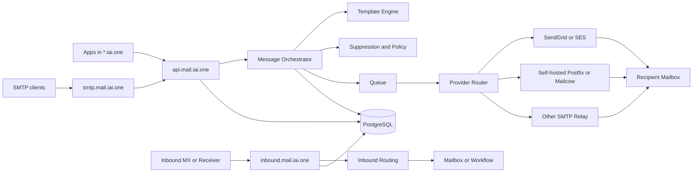

# MAIL_IAI_ONE_MASTER_ARCHITECTURE_FINAL

IAI Mail Delivery & Automation Layer

Version: 1.0 - Production Lock  
Date: 2026-04-14  
Owner: Tran Ha Tam

## 1. Muc tieu

Tai lieu nay khoa kien truc tong the cho mot du an mail doc lap de team dev build ngay, trong khi `mail.iai.one` da co ban dang duoc phat trien.

Muc tieu cua he thong:
- Tao mot Mail Control Plane do IAI so huu.
- Tat ca app trong `*.iai.one` chi gui mail qua mot lop API va policy duy nhat.
- Cho phep thay backend chuyen phat ma khong sua code app phia tren.
- Tach biet runtime, deliverability, template, automation, analytics, inbound.
- Khong co app nao gui SMTP truc tiep den provider.

## 2. Nguyen tac kien truc

1. `mail.iai.one` la lop product va control plane, khong phai chi la hop thu.
2. Outbound backend la plugin thay duoc: `selfhosted`, `smtp relay`, `ses`, `sendgrid`, `custom`.
3. Runtime gui mail phai provider-agnostic.
4. Stream reputational phai tach rieng: `transactional`, `system`, `marketing`, `alerts`.
5. Deliverability la mot lop rieng, khong gop lam "cau hinh DNS".
6. Inbound va outbound la hai luong khac nhau, phai duoc van hanh va log doc lap.
7. Control plane khong duoc tro thanh dependency blocking cho API runtime.

## 3. Vi tri cua `mail.iai.one` dang co

Tai thoi diem khoa kien truc:
- `mail.iai.one` dang duoc dev san.
- Khong yeu cau dap bo hoac rewrite ngay.
- Mac dinh xem `mail.iai.one` hien tai la ung vien cho `apps/mail-web`.
- Neu code hien tai chua phu hop, cho phep dung no lam admin UI tam thoi, con runtime moi duoc build doc lap ben duoi.

Quyet dinh:
- Khong de tien do runtime phu thuoc vao viec migrate UI.
- API, queue, provider routing va suppression phai duoc tach ra thanh he rieng.

## 4. System boundary

He thong chuan gom 4 hostname product va nhieu stream domain:

- `mail.iai.one`: admin dashboard va control plane
- `api.mail.iai.one`: send API, admin API, webhook ingest, event ingest
- `smtp.mail.iai.one`: SMTP submission cho app cu, ERP, scanner, external client
- `inbound.mail.iai.one`: inbound parser va routing engine
- `tx.iai.one`: stream transactional
- `sys.iai.one`: stream system
- `news.iai.one` hoac `mkt.iai.one`: stream marketing
- `alerts.iai.one`: stream canh bao
- `bounces.iai.one`: return-path va bounce handling
- `dmarc.iai.one`: report inbox/parser

## 5. Thanh phan chinh

### 5.1 Control Plane

Chuc nang:
- Domains
- Sender identities
- Templates
- Automations
- Provider routes
- DNS health
- Queue health
- Event explorer
- Suppression center
- Audit log

### 5.2 Mail API Runtime

Chuc nang:
- `POST /v1/send`
- `POST /v1/send-template`
- `POST /v1/send-bulk`
- message lookup
- webhook ingest
- event ingest
- idempotency
- workspace isolation

### 5.3 Message Orchestrator

Chuc nang:
- validate sender policy
- render template
- check suppression
- chon provider route
- queue message
- retry/backoff
- failover
- ghi event va audit

### 5.4 SMTP Submission Service

Chuc nang:
- auth client SMTP
- map credential -> workspace -> sender policy
- support `587` STARTTLS la chuan
- dua message vao chung message orchestrator

### 5.5 Inbound Engine

Chuc nang:
- nhan raw mail
- parse header/body/attachment
- check SPF/DKIM/DMARC result inbound
- route vao mailbox, webhook, automation, CRM, ticket

### 5.6 Deliverability Engine

Chuc nang:
- DNS health
- DKIM key lifecycle
- DMARC monitor
- recipient-domain throttling
- warmup policy
- bounce classification
- complaint handling
- unsubscribe enforcement

### 5.7 Event and Analytics Layer

Chuc nang:
- normalized message events
- delivery attempts
- provider latency
- bounce and complaint trends
- open/click optional
- operational health dashboard

## 6. Kien truc logic

## 7. Data plane va control plane

### Data plane
- API runtime
- queue workers
- SMTP submission
- inbound parser
- provider adapters

### Control plane
- dashboard
- DNS wizard
- operator tools
- analytics
- audit log
- automation builder

Quy tac:
- Neu dashboard down, send API co the van song.
- Neu provider bi loi, queue va retry van hoat dong.
- Neu mot provider chet, route failover sang provider khac.

## 8. Kien truc trien khai

### Bat buoc cho v1
- PostgreSQL cho metadata va event index
- Object storage cho raw payload va attachment
- Queue co retry/backoff
- Secret manager cho provider credentials
- API va worker tach process

### Khuyen nghi cho rollout day 1
- Provider primary: `SendGrid` hoac `SES`
- Provider backup: provider con lai hoac `SMTP relay`
- Self-hosted outbound pool chi dung sau khi warmup dat yeu cau

## 9. Luong gui mail chuan

1. App goi `POST /v1/send` hoac `POST /v1/send-template`
2. API xac thuc workspace, sender, stream, domain
3. Suppression engine chan recipient neu can
4. Template engine render noi dung
5. Router chon provider route theo stream + policy
6. Queue tao job giao
7. Worker gui qua adapter
8. Webhook ingest cap nhat event `delivered`, `bounced`, `complained`
9. Dashboard doc du lieu tu event va message tables

## 10. Luong inbound chuan

1. Mail den MX hoac receiver
2. Inbound engine parse raw mail
3. Xac thuc auth results, spam score, header hygiene
4. Match inbound route
5. Chuyen vao mailbox, webhook, ticket hoac automation
6. Ghi log toan bo event va attachment metadata

## 11. Quy tac khong duoc vi pham

- Khong service nao trong `*.iai.one` gui provider truc tiep.
- Khong dung chung IP/stream cho `marketing` va `password reset`.
- Khong cho marketing di qua sender identity transactional.
- Khong gui volume lon khi domain chua dat SPF/DKIM/DMARC.
- Khong bo qua suppression do hard bounce hoac complaint.

## 12. Non-goals cua ngay dau

Nhung thu sau khong duoc tuyen bo la "xong production" trong ngay:
- reputation tot voi Gmail/Outlook
- warmup IP hoan chinh
- inbox placement on dinh o volume lon
- complaint loop mature cho moi stream

## 13. Definition of Done cua kien truc

Kien truc duoc xem la khoa khi:
- Co mot control plane ro rang cho `mail`, `api`, `smtp`, `inbound`
- Co routing engine doc lap backend
- Co model stream tach reputational
- Co data model message, recipient, delivery attempt, event
- Co deliverability policy va DNS policy rieng
- Co huong tich hop voi `mail.iai.one` dang ton tai ma khong gay block
