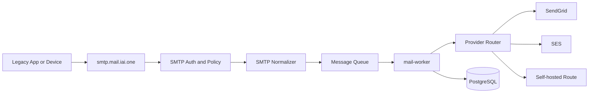

# MAIL_IAI_ONE_TEAM_SMTP_RELAY_MAIL_EXECUTION_PLAN_FINAL

IAI Mail Delivery & Automation Layer

Team SMTP RELAY mail Execution Plan  
Version: 1.0 - Production Lock  
Date: 2026-04-14

## 1. Muc tieu cua team

Team SMTP RELAY mail chiu trach nhiem xay dung va van hanh lop SMTP submission va outbound relay an toan cho toan he `*.iai.one`, theo dung kien truc provider-agnostic da khoa.

Team nay khong chi "mo cong SMTP". Team nay phai dam bao:
- app cu gui duoc mail qua `smtp.mail.iai.one`
- moi mail van di qua sender policy, stream policy, suppression va routing engine
- khong co open relay
- co du kha nang failover sang relay/provider khac
- co day du audit, logs, health va runbook van hanh

## 2. Pham vi trach nhiem

### Trong pham vi
- `apps/mail-smtp`
- phan SMTP-related trong `apps/mail-api` va `apps/mail-worker`
- mapping tu SMTP session sang normalized message model
- SMTP auth va credential lifecycle
- STARTTLS/TLS policy
- rate limit va anti-abuse policy
- test relay route voi `SendGrid`, `SES`, `SMTP relay` va `selfhosted`
- bounce/DSN correlation cho luong gui qua SMTP submission
- van hanh `smtp.mail.iai.one`

### Ngoai pham vi
- template UI
- admin dashboard tong the
- domain marketing strategy tong quat
- inbound mailbox routing

## 3. Output bat buoc team nay phai giao

1. SMTP submission service nghe tren `smtp.mail.iai.one:587`
2. TLS va auth policy hoan chinh
3. Credential model map toi `workspace_id`, sender va stream
4. Normalizer SMTP -> core send request
5. Queue handoff tu SMTP sang `mail-worker`
6. Reject/reason mapping ro rang
7. Healthcheck va runbook
8. Test plan va smoke checklist
9. Cutover plan cho app noi bo dang gui mail truc tiep

## 4. Nguyen tac team phai giu

1. SMTP la mot input surface, khong phai mot he rieng.
2. Khong co client nao duoc relay anonymous.
3. Khong cho phep `From` domain chua verify.
4. Khong cho phep SMTP bypass suppression hoac provider routing.
5. Khong de `mail.iai.one` UI block viec launch SMTP runtime.
6. Port `25` khong duoc xem la duong submission chinh.
7. Uu tien `587` STARTTLS, `465` chi la compatibility option.

## 5. Kien truc team phai build

## 6. Team structure de xuat

### Lead SMTP Runtime
- chot protocol behavior
- chot auth policy
- chot go-live checklist

### Engineer A - SMTP server va session layer
- EHLO/STARTTLS/AUTH/SIZE
- error mapping SMTP
- connection lifecycle

### Engineer B - Policy va normalization
- envelope/header validation
- sender policy
- stream mapping
- normalized message payload

### Engineer C - Delivery handoff va relay routes
- queue handoff
- worker integration
- provider route testing
- DSN/bounce correlation

### Engineer D - QA va van hanh
- smoke tests
- abuse tests
- healthcheck
- runbook va incident checklist

## 7. Work breakdown structure

### Workstream 1 - SMTP protocol surface
- chon server library/runtime
- support `EHLO`
- support `STARTTLS`
- support `AUTH LOGIN` va `AUTH PLAIN`
- support `SIZE`
- reject request sai policy bang SMTP code phu hop

Deliverable:
- server co the nhan submit va tra `250` khi da queue thanh cong

### Workstream 2 - Auth va credential model
- xac dinh bang/record luu SMTP principal
- hash secret, khong luu plain password
- map credential -> workspace -> sender -> allowed streams
- support disable/revoke credential
- log auth success/failure

Deliverable:
- mot credential co the duoc cap, rotate, revoke va audit

### Workstream 3 - Sender va stream enforcement
- validate `MAIL FROM`
- validate header `From`
- map stream mac dinh theo credential
- support `X-IAI-Stream` neu duoc cap quyen
- reject marketing neu sender khong duoc phep

Deliverable:
- client khong the dung sai sender hoac sai stream

### Workstream 4 - Message normalization
- parse MIME
- trich xuat subject/body/recipient/attachments/headers
- generate `message_id`
- map ve payload chung cua `POST /send`
- dua vao queue thay vi gui truc tiep provider

Deliverable:
- luong SMTP va luong API sinh cung mot core model

### Workstream 5 - Queue va worker integration
- queue accept path
- retryable vs non-retryable classification
- worker tiep nhan job gui tu SMTP
- message/event tracking day du

Deliverable:
- message tu SMTP hien trong message log va event timeline nhu message gui qua API

### Workstream 6 - Relay/provider verification
- test route `SendGrid`
- test route `SES`
- test route backup `SMTP relay`
- test route `selfhosted` neu co
- xac nhan failover khong mat message

Deliverable:
- bang ket qua route test va route uu tien chot cho day 1

### Workstream 7 - Abuse prevention va operations
- connection rate limit
- auth failure throttling
- recipient limit
- message size limit
- temporary blocklist neu can
- health endpoint va runbook

Deliverable:
- khong co open relay va co guardrail ro rang

## 8. Thu tu thuc hien ngay sau khi pack chung xong

### Phase A - 0 den 2 gio
- review SMTP spec da khoa
- chot ownership tung engineer
- chot runtime/language/library
- chot provider primary va backup de test

### Phase B - 2 den 6 gio
- scaffold `apps/mail-smtp`
- implement STARTTLS + AUTH
- implement credential lookup
- implement reject codes co ban

### Phase C - 6 den 10 gio
- implement MIME normalization
- handoff vao queue
- ghi `messages`, `message_recipients`, `message_events`
- wiring voi `mail-worker`

### Phase D - 10 den 14 gio
- test route `SendGrid`/`SES`
- test invalid sender
- test suppressed recipient
- test too-large message
- test multi-recipient policy

### Phase E - 14 den 18 gio
- abuse hardening
- healthcheck
- dashboard/read model can thiet cho ops
- runbook
- cutover checklist

## 9. Detailed task board

### Block 1 - Setup
- [ ] Tao `apps/mail-smtp`
- [ ] Tao env schema SMTP
- [ ] Tao config loader
- [ ] Tao secret naming convention

### Block 2 - Auth
- [ ] Implement credential lookup
- [ ] Implement password hash verification
- [ ] Implement revoked/disabled credential check
- [ ] Implement audit log auth failure

### Block 3 - TLS
- [ ] Bat STARTTLS tren `587`
- [ ] Tu choi auth neu chua TLS
- [ ] Log TLS version va cipher
- [ ] Test client khong TLS bi reject

### Block 4 - Policy
- [ ] Check workspace active
- [ ] Check sender identity active
- [ ] Check domain verified
- [ ] Check stream allowed
- [ ] Check recipient count
- [ ] Check message size

### Block 5 - Normalization
- [ ] Parse `MAIL FROM`
- [ ] Parse `From`
- [ ] Parse recipients
- [ ] Parse HTML/Text body
- [ ] Parse attachments
- [ ] Build normalized message payload

### Block 6 - Queue
- [ ] Push queued message
- [ ] Record `queued` event
- [ ] Generate `X-IAI-Message-Id`
- [ ] Return `250` only after queue accept

### Block 7 - Delivery test
- [ ] Route qua `SendGrid`
- [ ] Route qua `SES`
- [ ] Failover test
- [ ] Bounce correlation test
- [ ] Complaint mapping test

### Block 8 - Operations
- [ ] Healthcheck script
- [ ] Smoke test script
- [ ] Incident runbook
- [ ] Credential rotation runbook
- [ ] Abuse response checklist

## 10. Dependencies voi team khac

### Can tu Team Runtime
- common message schema
- queue contract
- provider route config
- worker event mapping

### Can tu Team Deliverability/Infra
- sender/domain verification state
- DNS readiness
- TLS certificate va hostname
- secrets storage

### Can tu Team UI/Admin
- read model cho SMTP credential management sau nay
- route health display

## 11. API/DB contracts team nay phai dung

Team SMTP RELAY mail khong duoc tao schema rieng neu co the tan dung schema da khoa.

Phai dung toi thieu:
- `api_keys` hoac bang credential mo rong cho SMTP principal
- `sender_identities`
- `domains`
- `messages`
- `message_recipients`
- `delivery_attempts`
- `message_events`
- `suppressions`
- `provider_routes`

## 12. Quy tac reject SMTP

### Reject ngay o session layer
- auth fail
- TLS khong hop le
- unknown credential
- revoked credential

### Reject truoc queue
- sender khong hop le
- domain chua verify
- stream khong duoc phep
- recipient vuot policy
- message size vuot policy
- recipient dang suppress

### Accept
- chi tra `250` khi queue da chap nhan

## 13. Test cases bat buoc

### Happy path
- auth thanh cong
- gui 1 recipient text mail
- gui html + attachment
- gui nhieu recipient hop le

### Policy path
- sender sai domain
- sender dung domain chua verify
- stream marketing bang credential transactional
- recipient suppressed
- message vuot size

### Security path
- auth truoc TLS
- brute force auth failure
- anonymous relay attempt
- forged `X-IAI-Stream`

### Reliability path
- queue down
- worker down
- provider timeout
- failover route available

## 14. Monitoring va alerts

Can do duoc:
- auth failure rate
- TLS usage rate
- reject by reason
- queue accept rate
- submit latency
- connection concurrency
- provider route chosen
- bounce rate cua luong tu SMTP submission

Alerts bat buoc:
- auth failure spike
- queue accept rate giam manh
- provider timeout spike
- open relay suspicion

## 15. Runbook van hanh

Team phai viet va ban giao 4 runbook:
- `SMTP_GO_LIVE_RUNBOOK`
- `SMTP_INCIDENT_RESPONSE_RUNBOOK`
- `SMTP_CREDENTIAL_ROTATION_RUNBOOK`
- `SMTP_SMOKE_TEST_RUNBOOK`

Moi runbook phai co:
- dau hieu nhan biet
- buoc kiem tra
- lenh test
- dieu kien rollback
- nguoi chiu trach nhiem

## 16. Cutover plan cho app noi bo

### Wave 1
- app noi bo it rui ro
- volume thap
- transactional only

### Wave 2
- he thong can OTP/reset/login
- system notifications

### Wave 3
- external legacy clients
- app volume cao hon

Rule:
- khong migrate marketing qua SMTP submission ngay wave dau
- marketing uu tien qua API va route control chat hon

## 17. Risks va cach giam

### Rui ro 1 - Team mo thanh open relay
Giam:
- bat AUTH + TLS
- sender allowlist
- connection throttle
- test abuse bat buoc truoc go-live

### Rui ro 2 - SMTP submission bypass core policy
Giam:
- normalize ve common message model
- queue qua worker chung
- khong cho SMTP service noi provider truc tiep

### Rui ro 3 - App legacy gui sai `From`
Giam:
- reject ro rang
- cap sender profile dung
- cung cap onboarding guide cho tung app

### Rui ro 4 - Port 25 expectations from old systems
Giam:
- tai lieu hoa ro `587` la submission chinh
- chi mo `465` neu can
- khong hua external MX-style relay cho client noi bo

## 18. Definition of Done cua Team SMTP RELAY mail

Team duoc xem la xong khi:
- `smtp.mail.iai.one:587` nhan duoc submit that
- moi mail di qua auth, sender policy, suppression, routing va queue
- khong co open relay
- co route test pass voi provider primary va backup
- co event/message trace day du trong he thong chung
- co monitoring, alerts va runbook van hanh
- co cutover checklist cho app noi bo

## 19. Quyet dinh launch day 1

Chot de team thuc hien ngay:
- SMTP submission la lop input cho app legacy
- outbound delivery day 1 van nen di qua `SendGrid` hoac `SES` sau router
- self-hosted outbound khong la route chinh neu chua warmup
- moi legacy app duoc onboarding theo credential rieng, khong dung credential chung
